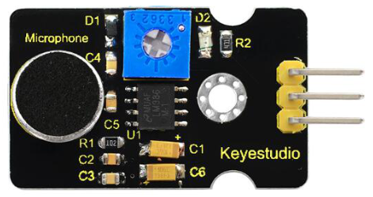
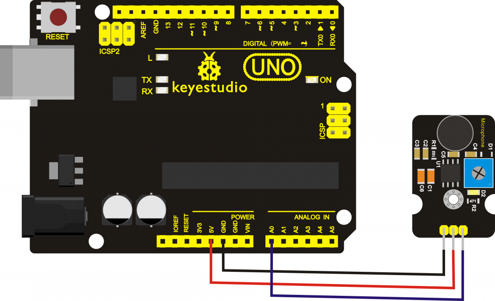
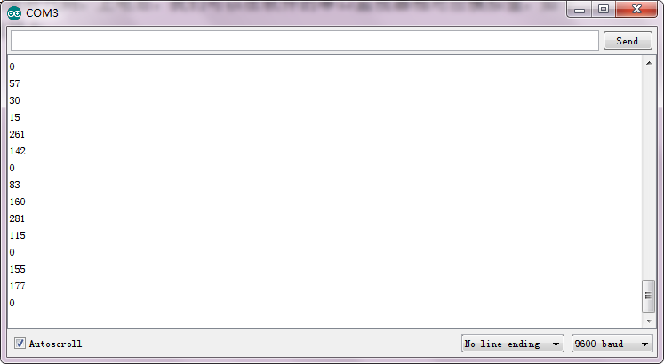

# KS0035 Microphone Sound Sensor with Potentiometer



## 1. Introduction

The keyestudio microphone sensor is typically used in detecting the loudness in ambient environment. The Arduino can collect its output signal by analog input interface. 

The S pin is analog output, that is voltage signal real-time output of microphone. The sensor comes with a potentiometer, so that you can turn it to adjust the signal gain.

It also has a fixed hole so that you can mount the sensor on any other devices. You can use it to make some interactive works, such as a voice operated switch.

## 2. Specification

- Operating voltage: 3.3V-5V（DC）
- Operating current: <10mA
- Interface：3PIN
- Output signal: Analog

## 3. Connection Diagram



## 4. Sample Code

Download code:  [Code](./Code.7z)

```c
int sensorPin =A0 ;  // define analog port A0
int value = 0;    //set value to 0

void setup() 
{
    Serial.begin(9600); //set the baud rate to 9600
} 
void loop() 
{
    value = analogRead(sensorPin);  //set the value as the value read from A0
    Serial.println(value, DEC);  //print the value and line wrap
    delay(200);  //delay 0.2S
} 
```

## 5. Test Result

Connect it up and upload the code successfully, then open the serial monitor on the right upper corner of Arduino IDE.

The analog value will pop up on the monitor window. The greater the sound, the greater the analog value is.



## 6. Further Use

